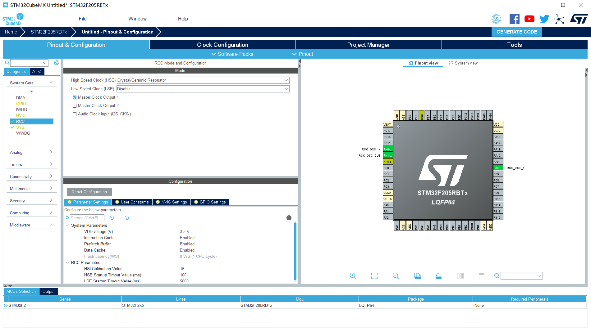
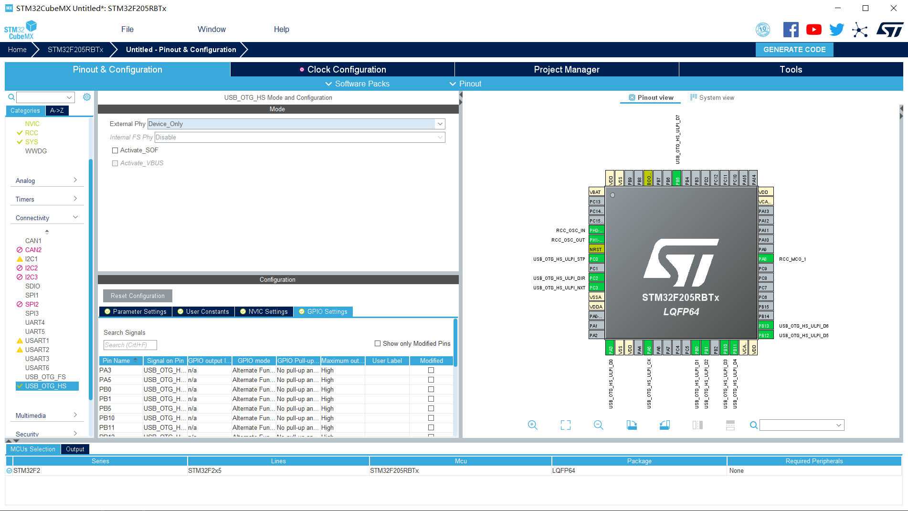
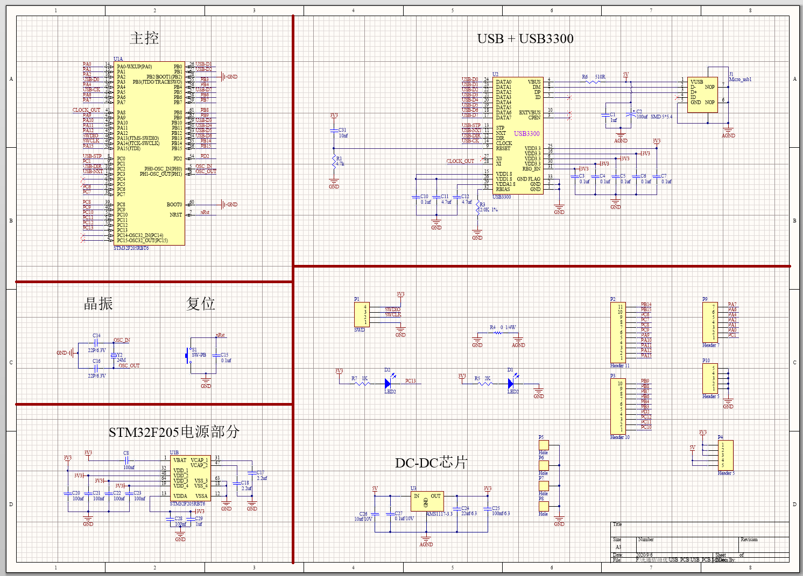
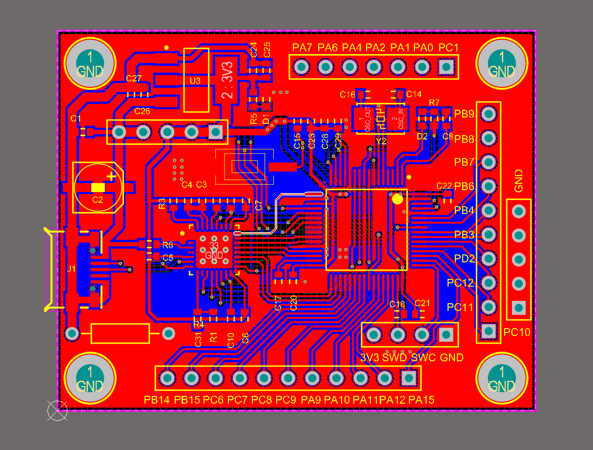
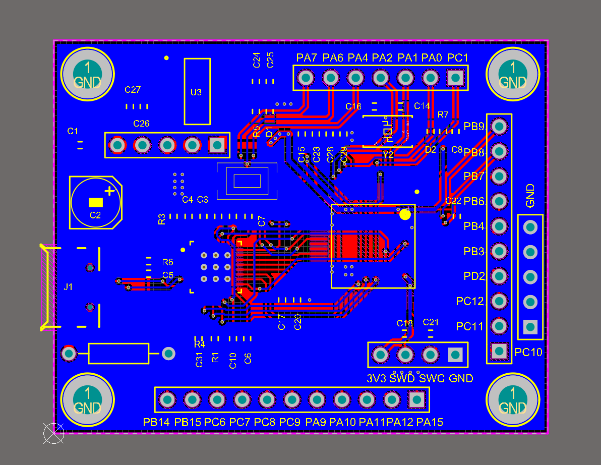
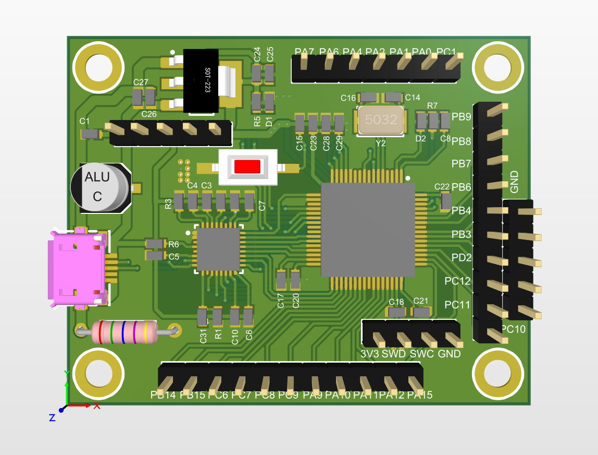

# STM32-linusb

STM32F205RBT6的USB_BULK数据传输，并使用libusb_win32编写上位机进行数据读写

## STM32F205RBT6程序编写

* 使用工具

    1. STM32CubeMX

        前期查阅了一些USB资料，发现使用 STM32CubeMX 是一个非常好的捷径。此软件以图形化的界面形式来让你实现自己的单片机底层及各个模块初始化设置，感觉好多单片机制造厂商都开发了自己的一套这样的设计工具，大大提高的开发效率。之前使用 Silab 公司单片机的时候，也接触过此类开发工具，使开发者摆脱了查阅硬件相关寄存器的烦恼，使我们更加专注顶层的设计。

    2. Bus Hound

        很好用的一个抓包工具，用来显示USB数据通信的方向，端口，数据等信息，通过USB传输的数据都可以在上面显示。可作为USB数据通信的检验工具。
        使用版本： 6.0.1
        使用方法自行查阅。

    3. libusb_win32

        相关资料自行查阅

* 实验步骤
  
  * 首先使用STM32CubeMX生成可用的HID程序
    * 首先打开CUBEMX,选择芯片型号为STM32F205RB

    * 然后打开NVIC配置选择2-2配置
      ！[中断分组](pictures/中断配置.png)

    * 之后配置RCC时钟，设置HSE时钟为外部时钟，并勾选 master clock output 1
      

    * 之后选择usb_otg_hs，配置为device_only
      

    * 打开middleware，usb_device,创建HID设备，并修改，PID、VID,等信息
      ！[usb类型设置](pictures/USB类型配置.png)

    * 之后来配置系统时钟，选择手动配置
      将外部HSE时钟频率修改为24MHZ,其他看图配置
      ！[时钟配置](pictures/时钟配置.png)

    * 打开project manager ，修改项目配置
      ！[项目配置](pictures/项目配置1.png)
      ！[项目配置](pictures/项目配置2.png)

  * 生成的程序打开后
    首选要打开```main.c```文件，修改 ```SystemClock_Config``` 中的时钟配置

    ```cpp
    //将 RCC_MCO1SOURCE_HSI 改为 RCC_MCO1SOURCE_HSE
    HAL_RCC_MCOConfig(RCC_MCO1, RCC_MCO1SOURCE_HSE, RCC_MCODIV_1);
    ```

  * 打开usbd_hid.h,新增端点定义

     ``` cpp
    #define HID_EPIN_ADDR                   0x81U
    #define HID_EPIN_SIZE                   512

    #define HID_EPOUT_ADDR                  0X01U
    #define HID_EPOUT_SIZE                  512

    #define USB_HID_CONFIG_DESC_SIZ         32U
    ```

    其中定义了两个端点（endpoint）0x81与0x01，USB数据传输都是通过端点。其中 “2” 是代表使用端口“2”，当然你也可以使用 0x81与0x01，代表使用端口“1”。bit7代表数据传输方向，bit7=1时，表示数据读入，数据由USB设备发送给USB主机；bit7=0时，表示数据输出，数据由USB主机发送给USB设备；具体的描述符细节请参考[配置参考]( https://www.cnblogs.com/tianchiyuyin/p/5139948.html)

    HID_EPIN_SIZE 与 HID_EPOUT_SIZE 为 512，表示单次传输的最大字节为 512，根据USB协议，HS模式下最大就 512 个字节。

    USB_HID_CONFIG_DESC_SIZ 为 32，这个值是配置描述符（USBD_HID_CfgFSDesc）数组的大小，根据实际包含的字节数量来更改。

  * 打开usbd_desc.c修改VIP,PID。这个最好修改了不然又是识别为HID设备。
  
    ``` cpp
    #define USBD_VID     1122
    #define USBD_LANGID_STRING     1033
    #define USBD_MANUFACTURER_STRING     "HXY-2020"
    #define USBD_PID_HS     6677
    #define USBD_PRODUCT_STRING_HS     "HXY-HID"
    #define USBD_CONFIGURATION_STRING_HS     "HID Config"
    #define USBD_INTERFACE_STRING_HS     "HID Interface"
    ```

  * 打开usbd_desc.c修改描述符

    首先修改设备描述符USBD_FS_DeviceDesc的bDeviceClass 修改为0xff,为自定义设备

    ```cpp
    __ALIGN_BEGIN uint8_t USBD_FS_DeviceDesc[USB_LEN_DEV_DESC] __ALIGN_END =
      {
        0x12,                       /*bLength */
        USB_DESC_TYPE_DEVICE,       /*bDescriptorType*/
        0x00,                       /*bcdUSB */
        0x02,
        0xFF,                       /*bDeviceClass*/
        0x00,                       /*bDeviceSubClass*/
        0x00,                       /*bDeviceProtocol*/
        USB_MAX_EP0_SIZE,           /*bMaxPacketSize*/
        LOBYTE(USBD_VID),           /*idVendor*/
        HIBYTE(USBD_VID),           /*idVendor*/
        LOBYTE(USBD_PID_FS),        /*idProduct*/
        HIBYTE(USBD_PID_FS),        /*idProduct*/
        0x00,                       /*bcdDevice rel. 2.00*/
        0x02,
        USBD_IDX_MFC_STR,           /*Index of manufacturer  string*/
        USBD_IDX_PRODUCT_STR,       /*Index of product string*/
        USBD_IDX_SERIAL_STR,        /*Index of serial number string*/
        USBD_MAX_NUM_CONFIGURATION  /*bNumConfigurations*/
      };
      ```

  * 打开usbd_hid.c，修改配置，接口，端口等描述符

      ```cpp
        /* USB HID device FS Configuration Descriptor */
      __ALIGN_BEGIN static uint8_t USBD_HID_CfgFSDesc[USB_HID_CONFIG_DESC_SIZ]  __ALIGN_END =
      {
          0x09, /* bLength: Configuration Descriptor size */
          USB_DESC_TYPE_CONFIGURATION, /* bDescriptorType: Configuration */
          USB_HID_CONFIG_DESC_SIZ,
          /* wTotalLength: Bytes returned */
          0x00,
          0x01,         /*bNumInterfaces: 1 interface*/
          0x01,         /*bConfigurationValue: Configuration value*/
          0x00,         /*iConfiguration: Index of string descriptor describing
          the configuration*/
          0xE0,         /*bmAttributes: bus powered and Support Remote Wake-up */
          0x32,         /*MaxPower 100 mA: this current is used for detecting Vbus*/

          /************** Descriptor of Joystick Mouse interface ****************/
          /* 09 */
          0x09,         /*bLength: Interface Descriptor size*/
          USB_DESC_TYPE_INTERFACE,/*bDescriptorType: Interface descriptor type*/
          0x00,         /*bInterfaceNumber: Number of Interface*/
          0x00,         /*bAlternateSetting: Alternate setting*/
          0x02,         /*bNumEndpoints*/
          0x00,         /*bInterfaceClass: HID*/
          0x00,         /*bInterfaceSubClass : 1=BOOT, 0=no boot*/
          0x00,         /*nInterfaceProtocol : 0=none, 1=keyboard, 2=mouse*/
          0,            /*iInterface: Index of string descriptor*/
          /******************** Descriptor of Joystick Mouse HID ********************/
          /* 18 */
          //  0x09,         /*bLength: HID Descriptor size*/
          //  HID_DESCRIPTOR_TYPE, /*bDescriptorType: HID*/
          //  0x11,         /*bcdHID: HID Class Spec release number*/
          //  0x01,
          //  0x00,         /*bCountryCode: Hardware target country*/
          //  0x01,         /*bNumDescriptors: Number of HID class descriptors to follow*/
          //  0x22,         /*bDescriptorType*/
          //  HID_MOUSE_REPORT_DESC_SIZE,/*wItemLength: Total length of Report descriptor*/
          //  0x00,
          /******************** Descriptor of Mouse endpoint ********************/
          /* 18 */
          0x07,          /*bLength: Endpoint Descriptor size*/
          USB_DESC_TYPE_ENDPOINT, /*bDescriptorType:*/

          HID_EPIN_ADDR,     /*bEndpointAddress: Endpoint Address (IN)*/
          0x02,          /*bmAttributes: Interrupt endpoint*/
          (uint8_t)HID_EPIN_SIZE, /*wMaxPacketSize: 4 Byte max */
          HID_EPIN_SIZE>>8,
          HID_FS_BINTERVAL,          /*bInterval: Polling Interval */
          /* 25 */
          0x07,          /*bLength: Endpoint Descriptor size*/
          USB_DESC_TYPE_ENDPOINT, /*bDescriptorType:*/

          HID_EPOUT_ADDR,     /*bEndpointAddress: Endpoint Address (OUT)*/
          0x02,          /*bmAttributes: Interrupt endpoint*/
          (uint8_t)HID_EPOUT_SIZE, /*wMaxPacketSize: 4 Byte max */
          HID_EPOUT_SIZE>>8,
          HID_FS_BINTERVAL,          /*bInterval: Polling Interval */
          /* 32 */
      };
      ```

    后面的```USBD_HID_CfgHSDesc```和```USBD_HID_OtherSpeedCfgDesc[USB_HID_CONFIG_DESC_SIZ]```也要做相应的修改

  * 在 usbd_hid.c 文件中添加声名数据接收函数（自动生成的功能中只有MCU通过USB发送数据的函数）```USBD_HID_DataOut```；
  
    声名USB接收数据缓存  ```USB_Rx_Buffer[HID_EPOUT_SIZE]```;

    声名USB接收数据个数变量  ```USB_Received_Count```；

    将 ```SBD_HID_DataOut```  函数加入到 ```USBD_HID```  数据结构中；

    ```cpp
    static uint8_t  USBD_HID_DataOut (USBD_HandleTypeDef *pdev, uint8_t epnum);

    uint8_t USB_Rx_Buffer[HID_EPOUT_SIZE];
    uint32_t USB_Received_Count;
    USBD_ClassTypeDef  USBD_HID =
    {
        USBD_HID_Init,
        USBD_HID_DeInit,
        USBD_HID_Setup,
        NULL, /*EP0_TxSent*/  
        NULL, /*EP0_RxReady*/
        USBD_HID_DataIn, /*DataIn*/
        USBD_HID_DataOut, /*DataOut*/ //此处之前为NULL
        NULL, /*SOF */
        NULL,
        NULL,
        USBD_HID_GetCfgDesc,
        USBD_HID_GetCfgDesc,
        USBD_HID_GetCfgDesc,
        USBD_HID_GetDeviceQualifierDesc,
    };
    ```

    修改USB初始化函数，添加对端口1输入与输出的初始化函数；并且将使能输出端口，时刻准备接收数据。

    ```cpp
    /**
      * @brief  USBD_HID_Init
      *         Initialize the HID interface
      * @param  pdev: device instance
      * @param  cfgidx: Configuration index
      * @retval status
      */
    static uint8_t  USBD_HID_Init(USBD_HandleTypeDef *pdev, uint8_t cfgidx)
    {
        /* Open EP IN */
        USBD_LL_OpenEP(pdev, HID_EPIN_ADDR, USBD_EP_TYPE_BULK, HID_EPIN_SIZE);
        pdev->ep_in[HID_EPIN_ADDR & 0xFU].is_used = 1U;

        /* Open EP OUT */
        USBD_LL_OpenEP(pdev, HID_EPOUT_ADDR, USBD_EP_TYPE_BULK,HID_EPOUT_SIZE);
        pdev->ep_out[HID_EPOUT_ADDR & 0xFU].is_used = 1U;

        pdev->pClassData = USBD_malloc(sizeof(USBD_HID_HandleTypeDef));

        if (pdev->pClassData == NULL)
        {
        return USBD_FAIL;
        }

        /* Prepare Out endpoint to receive 1st packet */
        USBD_LL_PrepareReceive(pdev, HID_EPOUT_ADDR, (uint8_t*)(USB_Rx_Buffer),HID_EPOUT_SIZE);

        ((USBD_HID_HandleTypeDef *)pdev->pClassData)->state = HID_IDLE;

        return USBD_OK;
    }
    ```

    同理，添加USB端口复位函数内容：

    ```cpp
    /**
      * @brief  USBD_HID_Init
      *         DeInitialize the HID layer
      * @param  pdev: device instance
      * @param  cfgidx: Configuration index
      * @retval status
      */
    static uint8_t  USBD_HID_DeInit(USBD_HandleTypeDef *pdev,
                                    uint8_t cfgidx)
    {
        /* Close HID EPs */
        USBD_LL_CloseEP(pdev, HID_EPIN_ADDR);
        pdev->ep_in[HID_EPIN_ADDR & 0xFU].is_used = 0U;

        /* Close HID EPs */
        USBD_LL_CloseEP(pdev, HID_EPOUT_ADDR);
        pdev->ep_out[HID_EPOUT_ADDR & 0xFU].is_used = 0U;

        /* FRee allocated memory */
        if (pdev->pClassData != NULL)
        {
        USBD_free(pdev->pClassData);
        pdev->pClassData = NULL;
        }

        return USBD_OK;
    }
    ```

    然后添加```USBD_HID_DataOut```函数，实现数据回环

    ```cpp
    static uint8_t USBD_HID_DataOut (USBD_HandleTypeDef *pdev, uint8_t epnum)
    {

        USB_Received_Count = USBD_GetRxCount( pdev,epnum );

        USBD_LL_PrepareReceive(pdev,
                    HID_EPOUT_ADDR,
                    (uint8_t*)(USB_Rx_Buffer),
                    HID_EPOUT_SIZE);

        USBD_HID_SendReport(pdev, (uint8_t*)USB_Rx_Buffer, USB_Received_Count);

        return USBD_OK;

    }
    ```

  * 编译下载，你就可以测试了。

## 程序测试

* 安装驱动
  
    首先需要使用 ```...\libusb-win32-bin-1.2.6.0\bin``` 路径下的 ```inf-wizard.exe``` 来生成驱动文件，生成时要选择自己的PID和VID。

    <font face="黑体" color=red size=3> 提示：最好使用管理员权限打开，这样能直接安装驱动文件 </font>

    安装完成后会在设备管理器中看到libusb类型的设备

* 安装```bushound```
  
  一路next就能安装完成，SN码在文件夹中，填入即可。安装完成后就能进行相关的测试。
  相关使用方法自行百度。

## 上位机

因为驱动使用的libusb-win32故后续的上位机也需要使用libusb-win32进行开发。

* 新建项目
  
  使用VS2015创建空白的控制台项目
  
  之后将```...\STM32-linusb\libusb-win32-bin-1.2.6.0\include``` 中的 ```lusb0_usb.h``` 复制到工程中，并添加到头文件中

  还需要将 ```...\STM32-linusb\libusb-win32-bin-1.2.6.0\lib\msvc``` 文件夹复制到工程中，将其添加到源文件中，工程就配置完成了，之后可以新建 ```main.c``` 文件进行编程。

* 开始编程
  
  程序代码中加入 : ```#include "lusb0_usb.h"```
  
  ```cpp
    1) 调用 void usb_init(void); 进行初始化

    2) 调用usb_find_busses、usb_find_devices和usb_get_busses这三个函数，获得已找到的USB总线序列；然后通过链表遍历所有的USB设备，根据已知的要打开USB设备的ID（VID/PID），找到相应的USB设备.

    3) 调用usb_open函数打开该USB设备

    4)int usb_set_configuration(m_dev_handle, 1)   //设置配置

    int usb_claim_interface(usb_dev_handle *dev, int interface);

    注册与操作系统通信的接口，这个函数必须被调用，因为只有注册接口，才能做相应的操作。

    5)与USB设备进行通信。使用函数

    int usb_bulk_write(usb_dev_handle *dev, int ep, char *bytes, int size, int timeout);//批量写入

    int usb_bulk_read(usb_dev_handle *dev, int ep, char *bytes, int size, int timeout);//批量读取

      从USB设备读取(接收)数据或向其写入(发送)数据。


    6) int usb_release_interface(usb_dev_handle *dev, int interface);

    注销被usb_claim_interface函数调用后的接口，释放资源，和usb_claim_interface对应使用。

    7)  int usb_close(usb_dev_handle *dev);

    与usb_open相对应，关闭设备，是必须调用的, 返回0成功，<0 失败。
    ```

## PCB文件

* 使用AD18进行设计
* 原理图
  
* PCB
  
  
  
  
* 详见USB_PCB文件夹.
